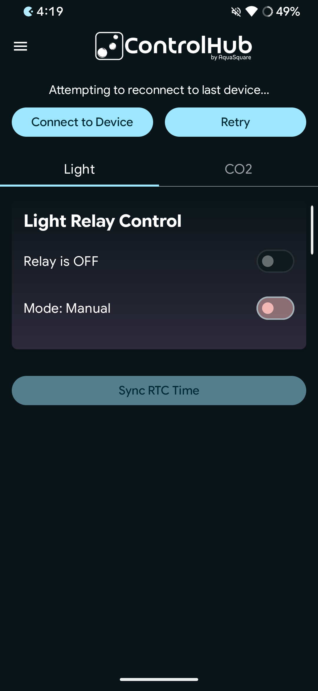
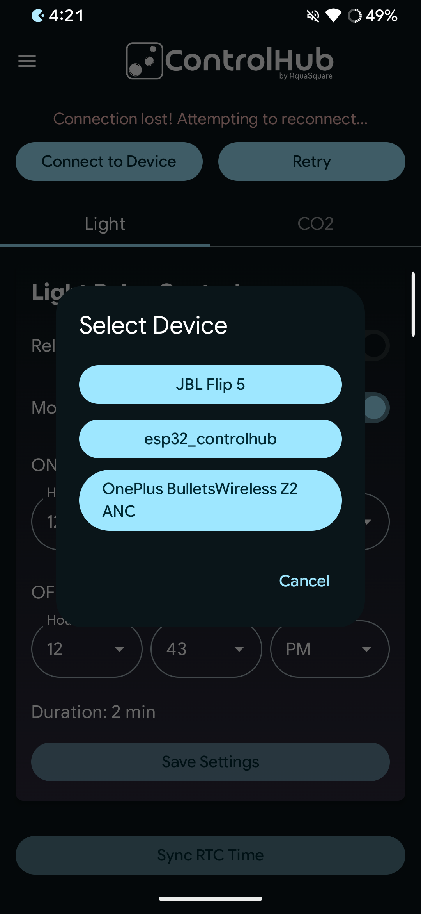
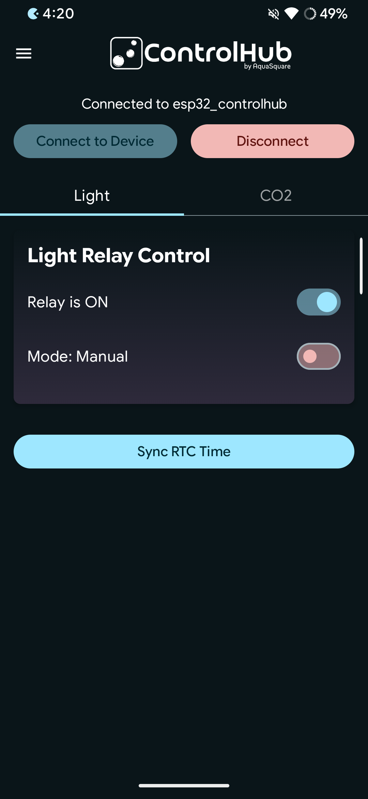
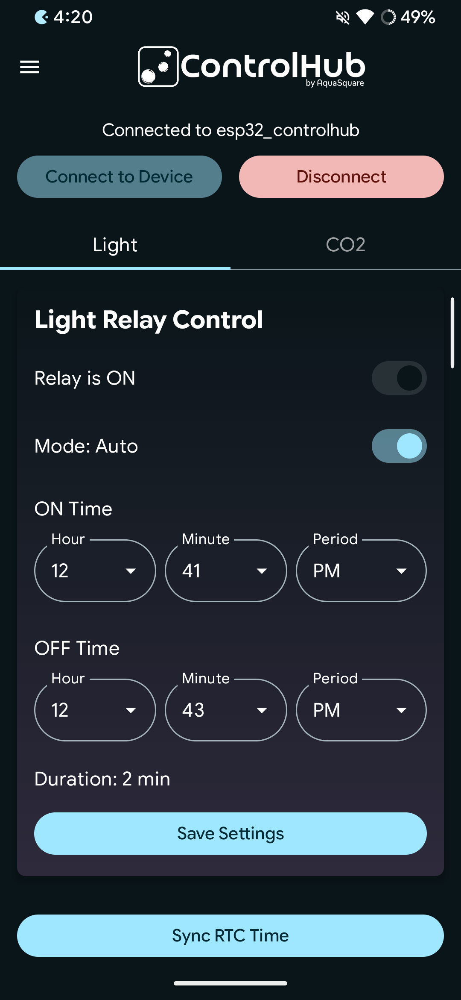
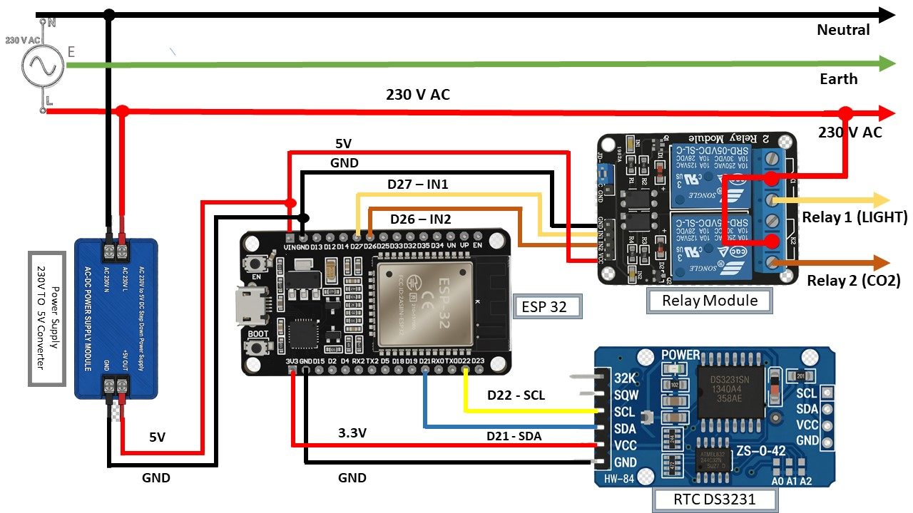
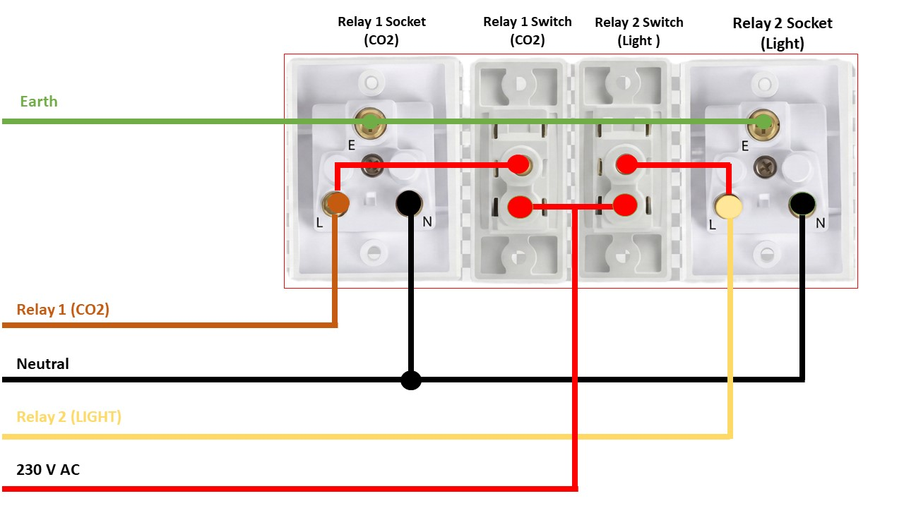

🎛️ControlHub – ESP32 Bluetooth Relay Controller
----------------------------------------------------------------------------------------------------------------------------------------

__📌 Introduction__

ControlHub is a simple Bluetooth-based relay control system using an ESP32, DS3231 RTC, and a 2-channel relay module, controlled from an Android app.

This project was built as a learning + fun project.
I am a beginner and this entire project was created using AI (vibe) coding, not professional embedded development,
even this github also created with help of Ai so think it

__The goal is:__

- Easy to build

- Easy to understand

- Works without Wi-Fi

- Useful in places where no internet is available

🤔 Why Bluetooth and NOT Wi-Fi?
---------------------------------------------------------
Many ESP32 projects use Wi-Fi, but Wi-Fi has problems:

❌ No Wi-Fi available in many places

❌ ESP32 Wi-Fi setup is difficult for beginners

❌ Time sync becomes hard without internet

❌ Router change = reconnect problem

__✅ Bluetooth advantages__

- Works anywhere

- No internet required

- Easy phone connection

- Stable local control

- RTC keeps time even without phone

- That is why Bluetooth + RTC was chosen.

## 📱 Android App Preview

  
  
  
  

__App features:__

- Connect to ESP32 via Bluetooth

- Manual ON / OFF control

- Auto mode with ON & OFF time

- RTC time sync

- Works offline
- 
  🧰 Hardware Used
  ---
__Component	Description__ 

ESP32 Dev Board -	Main controller

- DS3231                 - For time keeping

- 2-Channel Relay Module	- Controls AC loads

- 5V power supply       - I used Old Mobile Charger 

- Perf Board	            - Prototype board or use bread board for testing

- Wires & Enclosure	       - Switch Socket box with wire or use jumber wire for testing

⚡ HIGH VOLTAGE WARNING (IMPORTANT) ⚠️ Power Supply Note
----

__⚠️ DANGER – READ CAREFULLY__

- This project switches AC mains voltage

- My setup is ONLY A PROTOTYPE

- Wiring is NOT professional

- No isolation box for AC side

❗ DO NOT TOUCH the relay side when powered

❗ DO NOT COPY AC wiring blindly

❗ USE PROPER ENCLOSURE for real use

❗ CONSULT ELECTRICIAN if unsure

I am using an old mobile charger (5V) to power the ESP32 and relay module, if your seting up use proper 5V supply

👉 This project is for learning only, not production use.

🔌 Hardware Setup Overview
----

 
 

__Connections (Simple)__

 ESP32 → DS3231

- SDA → GPIO 21

- SCL → GPIO 22

- VCC → 3.3V

- GND → GND

 __ESP32 → Relay__

- Relay IN1 → GPIO 27 (Light)

- Relay IN2 → GPIO 26 (CO2)

- VCC → 5V

- GND → GND

## 🚀 Step-by-Step Setup

### 1️⃣ Upload ESP32 Firmware

1. **Install Arduino IDE**  
   👉 [Download Arduino IDE](https://www.arduino.cc/en/software)

2. **Install ESP32 Board Support in Arduino IDE**  
   👉 [ESP32 Arduino Core – Official Guide](https://docs.espressif.com/projects/arduino-esp32/en/latest/installing.html)

3. **Download the ESP32 from GitHub Releases**  
   👉 [Releases](https://github.com/akhil274/Control-Hub/releases/tag/v1.0.0)

4. **Unzip the file and open the Code **

5. **Select the Board esp32 dev board**

6. **Upload code**

7. **Open Serial Monitor (115200 baud) and Confirm Bluetooth started**

