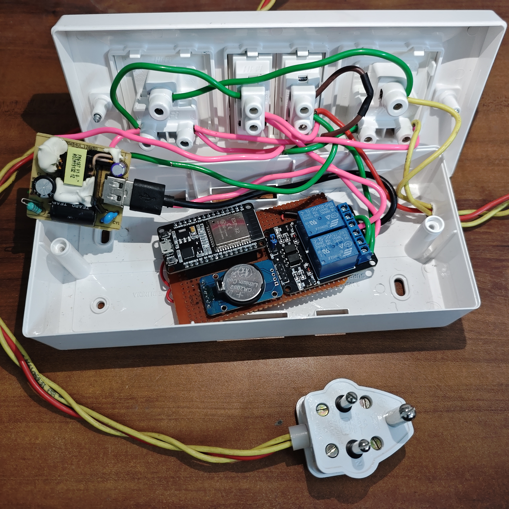
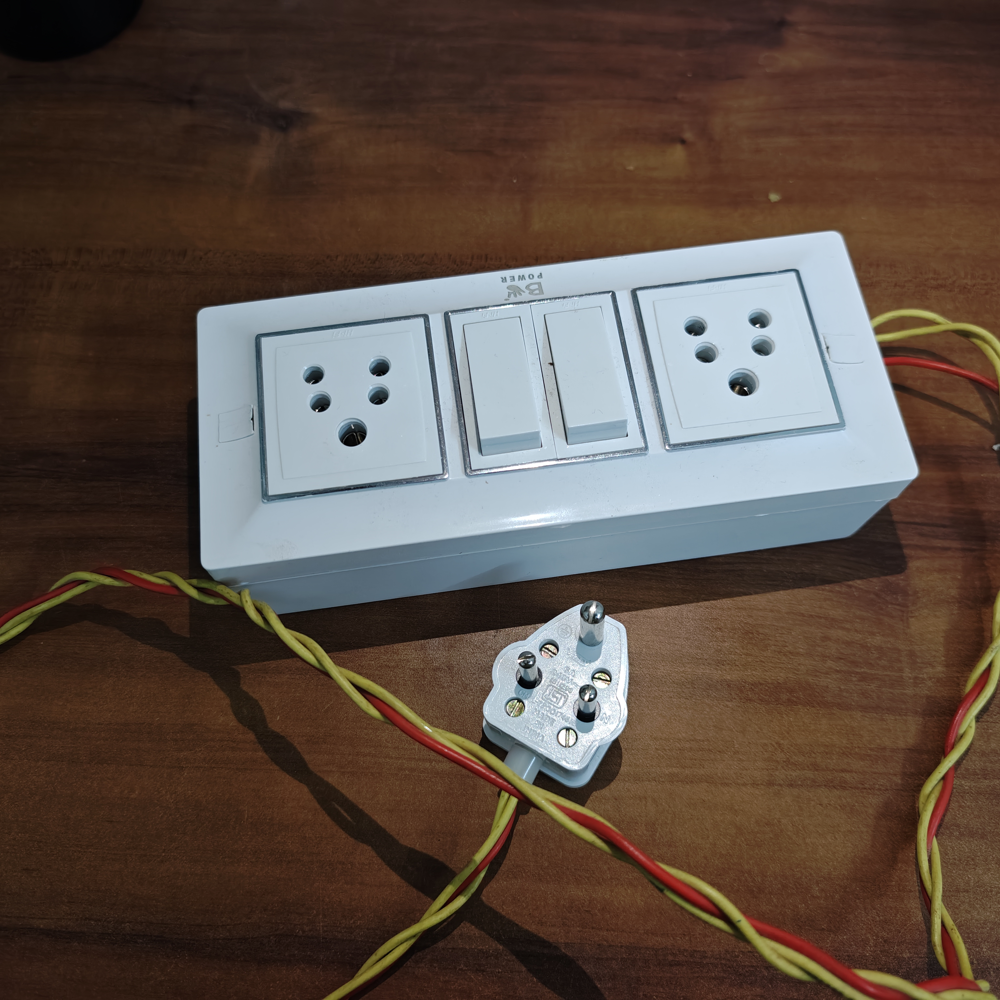

# 🎛️ ControlHub – ESP32 Bluetooth Relay Controller

---

## 📌 Introduction

**ControlHub** is a simple **Bluetooth-based relay control system** built using an **ESP32**, **DS3231 RTC**, and a **2-channel relay module**, controlled through an **Android app**.

This project was created as a **learning + fun project**.  
I am a **beginner**, and this entire project (including this GitHub repository) was built with the help of **AI-assisted (vibe) coding**, not professional embedded development.

### 🎯 Project Goals
- Easy to build  
- Easy to understand  
- Works **without Wi-Fi**  
- Useful where **no internet is available**

---

## 🤔 Why Bluetooth and NOT Wi-Fi?

Many ESP32 projects use Wi-Fi, but Wi-Fi has limitations:

- ❌ Wi-Fi may not be available everywhere  
- ❌ Wi-Fi setup is difficult for beginners  
- ❌ Time sync depends on internet  
- ❌ Router change causes reconnection issues  

### ✅ Why Bluetooth + RTC
- Works anywhere  
- No internet required  
- Simple phone connection  
- Stable local control  
- RTC keeps time even without phone  

👉 **That is why Bluetooth + RTC was chosen.**

---

## 📱 Android App Preview

  
  
  
  

### App Features
- Bluetooth connection to ESP32  
- Manual ON / OFF relay control  
- Auto mode with ON & OFF time  
- RTC time synchronization  
- Works fully offline  

---

## 🧰 Hardware Used

| Component | Description |
|--------|------------|
| ESP32 Dev Board | Main controller |
| DS3231 RTC | Accurate time keeping |
| 2-Channel Relay Module | Controls AC loads |
| 5V Power Supply | Old mobile charger (used by me) |
| Perf / Breadboard | Prototype setup |
| Wires & Enclosure | Switch socket box / jumper wires |

---

## ⚡ HIGH VOLTAGE WARNING (IMPORTANT)

⚠️ **DANGER – READ CAREFULLY**

- This project switches **AC mains voltage**
- My setup is **ONLY A PROTOTYPE**
- Wiring is **NOT professional**
- No proper isolation for AC side

❗ DO NOT touch relay side when powered  
❗ DO NOT blindly copy AC wiring  
❗ USE proper enclosure for real use  
❗ CONSULT a qualified electrician if unsure  

**Power Note:**  
I used an **old 5V mobile charger** to power the ESP32 and relay module.  
For real installations, **use a proper regulated 5V supply**.

👉 This project is for **learning only**, not production use.

---

## 🔌 Hardware Setup (Photos)

  
  

### Basic Connections

**ESP32 → DS3231**
- SDA → GPIO 21  
- SCL → GPIO 22  
- VCC → 3.3V  
- GND → GND  

**ESP32 → Relay**
- IN1 → GPIO 27 (Light)  
- IN2 → GPIO 26 (CO₂)  
- VCC → 5V  
- GND → GND  

---

## 🚀 Step-by-Step Setup

### 1️⃣ Upload ESP32 Firmware

1. Install [Arduino IDE](https://www.arduino.cc/en/software)
2. Install [ESP32 Board Support](https://docs.espressif.com/projects/arduino-esp32/en/latest/installing.html)
3. Download firmware from [GitHub Releases](https://github.com/akhil274/Control-Hub/releases/tag/v1.0.0)
4. Unzip and open the `.ino` file
5. Select **ESP32 Dev Module**
6. Upload code
7. Open Serial Monitor (115200 baud) and confirm Bluetooth started

---

### 2️⃣ Install Android App

**Option A: APK**
1. Download APK from [GitHub Releases](https://github.com/akhil274/Control-Hub/releases/tag/v1.0.0)  
2. Enable *Install unknown apps*  
3. Install APK  

**Option B: Build from source**
1. Open [android-app](ControlHub-Upload/android-app) in Android Studio  
2. Let Gradle sync  
3. Run app on phone  

---

### 3️⃣ Connect App to ESP32

1. Power ON ESP32  
2. Enable Bluetooth on phone  
3. Open ControlHub app  
4. Tap **Connect to Device**  
5. Pair and connect to ESP32  

---

### 4️⃣ Sync RTC Time

1. Press **Sync RTC Time**  
2. ESP32 saves phone time  
3. RTC keeps time even after power loss  

---

### 5️⃣ Use Relay Controls

- **Manual Mode** → Instant ON / OFF  
- **Auto Mode** → Set ON & OFF time  
- Click **Save Settings**  
- ESP32 runs independently

  ## My Hardware steup

  
  

---

## 🧠 Notes from the Creator

- Not a professional developer  
- No coding background  
- Built fully using AI assistance  
- Made for learning and fun  
- Code may not be perfect, but it works  

Feel free to improve or modify.

---

## 📜 License

MIT License – free to use, modify, and learn from.

---

## ⭐ Final Words

If you are a beginner, this project is for you.  
If you are experienced, please improve it and share back.

⭐ **If this helped you, please star the repository.**
